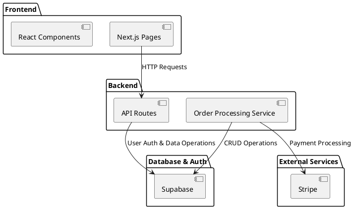

= SPEC-1: Gummy Supplements eCommerce Application
:sectnums:
:toc:

== Background

The rise in health consciousness among consumers has led to increased demand for nutritional supplements. Gummy supplements, known for their convenience and appeal, have become particularly popular. This eCommerce application aims to cater to health-conscious customers by providing a platform focused on selling high-quality gummy supplements. The goal is to create an easy-to-use, visually appealing, and secure online store that meets the needs of this target audience.

== Requirements

The eCommerce application will be designed with the following requirements, prioritized using the MoSCoW method:

=== Must Have
* User authentication (sign-up, login, password recovery)
* Product listings with detailed information (images, descriptions, prices, nutritional info)
* Shopping cart functionality
* Secure checkout process
* Payment gateway integration (e.g., Stripe, PayPal)
* Order management system for both customers and administrators
* Mobile responsiveness

=== Should Have
* Customer reviews and ratings for products
* Wishlist functionality
* User profile management
* Basic SEO optimization

=== Could Have
* Live chat support
* Integration with social media for sharing products
* Subscription service for regular delivery of products

=== Won't Have
* Multi-vendor support
* Physical store integration

== Method

=== Technical Architecture

We'll use Next.js for the frontend and backend (server-side rendering), providing a seamless user experience and better SEO. The following components will be part of the architecture:

- **Frontend**: Next.js with React for building dynamic and responsive user interfaces.
- **Backend**: Next.js API routes for server-side logic, including authentication and order processing.
- **Database and Authentication**: Supabase for relational data management and secure user authentication.
- **Payment Gateway**: Stripe for handling payments.
- **Deployment**: Vercel for hosting the application.

=== Component Diagram

Let's outline the major components and their interactions.



=== Database Schema

Here is the database schema for the application, using Supabase:

```asciidoc
== Database Schema

=== Users
* id (UUID, primary key)
* email (string, unique, not null)
* password_hash (string, not null)
* name (string)
* address (text)
* created_at (timestamp)
* updated_at (timestamp)

=== Products
* id (UUID, primary key)
* name (string, not null)
* description (text)
* price (decimal, not null)
* stock_quantity (integer, not null)
* image_url (string)
* created_at (timestamp)
* updated_at (timestamp)

=== Orders
* id (UUID, primary key)
* user_id (UUID, foreign key, references Users)
* total_amount (decimal, not null)
* status (string, not null)
* created_at (timestamp)
* updated_at (timestamp)

=== Order_Items
* id (UUID, primary key)
* order_id (UUID, foreign key, references Orders)
* product_id (UUID, foreign key, references Products)
* quantity (integer, not null)
* price (decimal, not null)
* created_at (timestamp)
* updated_at (timestamp)
```

=== Algorithms and Business Logic

1. **User Authentication**:
   - Supabase provides built-in authentication with JWT tokens for secure session management.
   - Password hashing and management are handled by Supabase.

2. **Order Processing**:
   - Validate stock availability before confirming orders.
   - Handle transactions to ensure atomicity (using Supabase transactions).

3. **Payment Integration**:
   - Integrate Stripe for handling payments securely.
   - Webhooks to update order status upon successful payment.

== Implementation

=== Step 1: Set Up the Development Environment
1. Install Node.js and npm.
2. Install the Next.js framework using npm.
   ```
   npx create-next-app@latest ecommerce-app
   cd ecommerce-app
   ```
3. Set up Supabase by creating an account at supabase.io and creating a new project.
4. Install Supabase client library.
   ```
   npm install @supabase/supabase-js
   ```

=== Step 2: Configure Supabase
1. Set up the Supabase database schema as described in the Database Schema section.
   - Use the Supabase dashboard to create tables for Users, Products, Orders, and Order_Items.
2. Configure authentication in Supabase.
   - Enable email and password authentication.

=== Step 3: Develop Frontend Components
1. Create the main pages using Next.js:
   - Home page
   - Product listing page
   - Product detail page
   - Shopping cart page
   - Checkout page
   - User profile page
   - Admin dashboard (if necessary)
2. Develop React components for reusable UI elements:
   - Navbar
   - Footer
   - Product card
   - Shopping cart items

=== Step 4: Implement Authentication
1. Integrate Supabase authentication in Next.js.
   - Configure Next.js API routes for sign-up, login, and password recovery.
   - Use Supabase client to handle authentication requests.
2. Create authentication context to manage user sessions.

=== Step 5: Develop Backend API Routes
1. Create API routes in Next.js for:
   - User authentication (login, sign-up, logout)
   - Product CRUD operations (for admin)
   - Order processing (creating orders, viewing order history)
   - Payment processing (integrate Stripe)

=== Step 6: Implement Payment Integration
1. Set up a Stripe account and obtain API keys.
2. Integrate Stripe in the Next.js application.
   - Configure API routes to handle payments.
   - Implement Stripe checkout on the frontend.
   - Set up webhooks to handle payment confirmations and update order status.

=== Step 7: Finalize UI and UX
1. Ensure the application is fully responsive.
2. Optimize for SEO.
3. Conduct thorough testing of all features.
   - Unit tests for individual components.
   - Integration tests for API routes.
   - End-to-end tests for user flows.

=== Step 8: Deploy the Application
1. Deploy the Next.js application on Vercel.
2. Configure environment variables for Supabase and Stripe.
3. Set up CI/CD pipelines for automated deployments.

=== Step 9: Monitor and Maintain
1. Set up monitoring tools (e.g., Vercel Analytics, Supabase monitoring).
2. Regularly update dependencies.
3. Address user feedback and bug reports.

== Milestones

1. **Week 1-2**: Set up the development environment and configure Supabase.
2. **Week 3-4**: Develop frontend components and implement authentication.
3. **Week 5-6**: Develop backend API routes and integrate payment processing.
4. **Week 7-8**: Finalize UI/UX and conduct testing.
5. **Week 9**: Deploy the application.
6. **Ongoing**: Monitor and maintain the application.

== Gathering Results

1. **Performance Metrics**: Track load times, API response times, and user interaction metrics using monitoring tools.
2. **User Feedback**: Collect feedback from users regarding usability, features, and overall satisfaction.
3. **Sales Data**: Analyze sales data to understand customer behavior and product performance.
4. **Bug Reports**: Monitor and address any bugs or issues reported by users.
